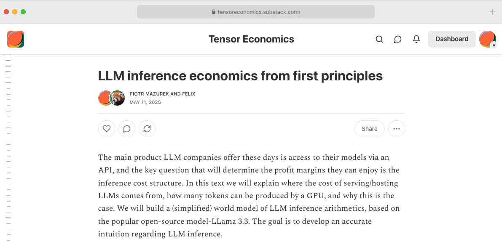
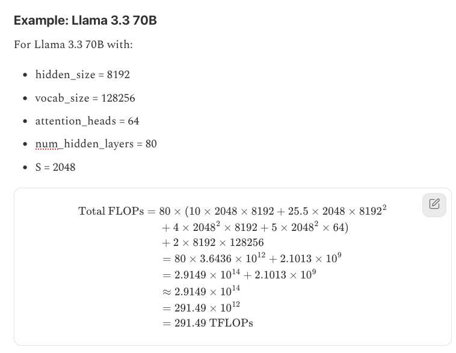
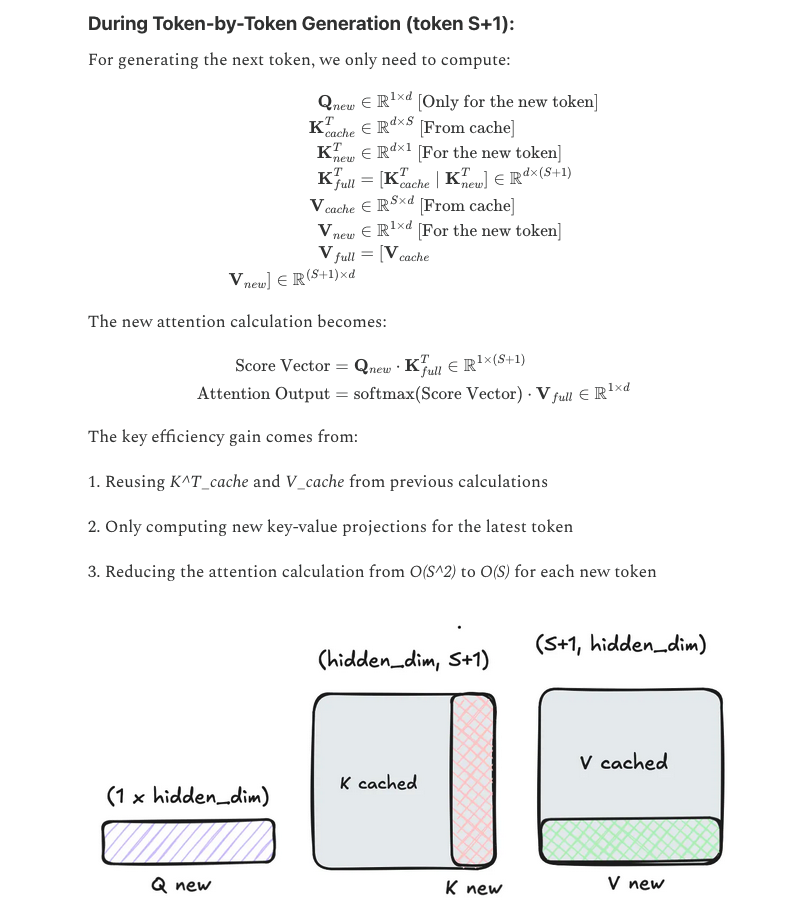
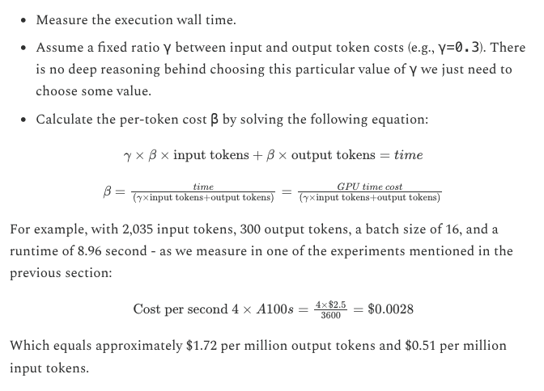

Together with @felix_red_panda today, we present the "LLM inference economics from first principles" - our introduction into the fascinating world of quantifying the cost of intelligence. In our text we:

- Do a deep technical breakdown of the cost behind producing a token. 

- Show how your tokenomics are mostly contingent on the batch size you can run.

- Show how to model this and how to translate the throughput to dollars.

--- 

Check out the blogpost at: HERE URL

---
As an example model to investigate we use Llama 3.3 70B. 

---
We discuss FLOPS during the forward pass and the tradeoff between the compute and memory bandwidth.

---
We show how KV drastically limits the number of computations required and how the decoding phase is becoming memory, not compute-bound, as a result. 

---
We show how batching is the key to good tokenomics and how hard it is to offer an affordable service if you lack the required scale.

---
Lastly, we show how to move from tokens to dollars; we introduce a simple strategy of deriving a price per token based on the throughput we obtain.

---
Check out the entire blog post, and we hope it helps you to build a more accurate world model on LLM inference. 

<Link to blogpost again>

